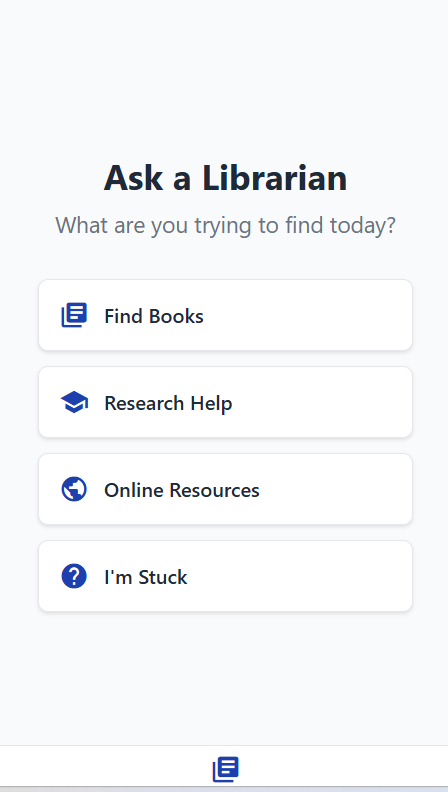

# Ask a Librarian – Micro UX Prototype

This project is a lightweight mobile prototype built in Thunkable that simulates a digital reference desk for overwhelmed students.

The goal is to demonstrate how UX design can reduce cognitive load and guide users toward trustworthy information sources.

## Features
- Friendly, low-friction home screen  
- Four common student intents:
  - Find Books  
  - Research Help  
  - Online Resources  
  - I'm Stuck  
- Each path offers a clear “Start Here” action  

## Why This Matters
Students often arrive with vague questions and high anxiety.  
This design models how libraries can meet users where they are—without shame, overload, or jargon.

## Skills Demonstrated
- User-centered navigation  
- Information literacy framing  
- Digital librarianship in practice  
- Rapid prototyping  

## Screenshots

